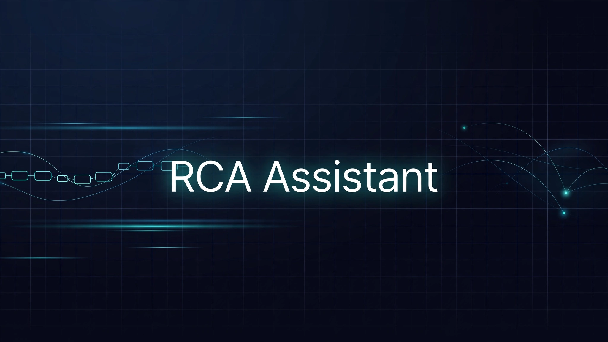
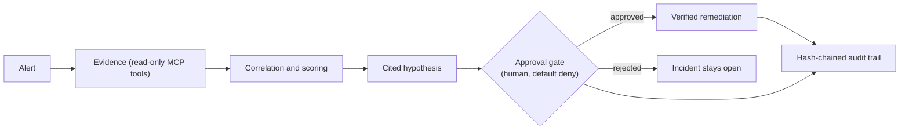

# RCA Assistant

[](https://github.com/pramodreddyboddu/rca-assistant/actions)
[](LICENSE)
[](https://www.python.org/)
[](https://github.com/pramodreddyboddu/rca-assistant/releases/tag/v0.7.0)



**When middleware breaks at 2 AM, RCA Assistant tells you why, shows its evidence, and waits for your approval before touching anything.**

## 60-second quickstart

Install from the release tag and run the full incident loop against a simulated estate. No infrastructure, no credentials, no setup.

```bash
pip install git+https://github.com/pramodreddyboddu/rca-assistant.git@v0.7.0
rca demo
```

Prefer a prebuilt wheel? Download `rca_assistant-0.7.0-py3-none-any.whl` from the [v0.7.0 release page](https://github.com/pramodreddyboddu/rca-assistant/releases/tag/v0.7.0) and `pip install` it.

The demo injects an incident (for example a stopped MQ channel), gathers evidence with read-only tools, scores root-cause hypotheses with citations, and proposes a remediation plan that only runs after you approve each step. A local browser UI is available too: `python -m demo.web` (loopback only, built for screen-sharing).

Want a real incident instead of a simulated one? The incident room replays a genuine stopped-channel incident recorded live on QM1 (IBM MQ 10.0.0.5) through the real connector read paths, with approval rehearsed (never executed): `rca incident`. See [docs/INCIDENT_ROOM.md](docs/INCIDENT_ROOM.md).

## What it does

- **Diagnoses with evidence, not vibes.** The engine runs evidence plans through read-only MCP tools, scores each hypothesis 0.0-1.0 by matched checks, and cites the exact evidence behind every claim.
- **Covers the middleware you actually run.** 21 registered connectors across message brokers, app servers, web servers, databases, caches, and container platforms: 90 MCP tools (66 read-only, 24 privileged) and 45 incident scenarios.
- **Reasons with calibrated confidence.** With `TYPESAFE_API_KEY` set, the Jev reasoning layer adds typed hypothesis confidence, per-claim evidence-support verdicts, triage priority (P1-P4), and remediation risk class to every diagnosis. Without a key, the deterministic engine runs alone, clearly labeled.
- **Never acts without you.** Remediation is built as data, never executed by the engine. A default-deny approval gate turns a plan step into an action only on your live grant, and re-verifies with read-only tools after every step.
- **Proves every move.** Every tool call, denial, approval, execution, and halt lands in a hash-chained, tamper-evident audit log.
- **Onboards in minutes.** The connector self-test harness validates each connector with 10 contract checks: no pytest, no credentials, no live target required.
- **Speaks MCP natively.** The same 90 tools are exposed over stdio for external MCP clients, behind one policy-enforcement point.

## Supported technologies

All 21 connectors are real client implementations. Driver/transport coverage is honest: fake-transport/fake-driver tested in the suite, live validation happens as the customer self-test step in a pilot via `python -m connectors.harness --connector NAME`.

| Technology | Connector | Transport | Tools |
|---|---|---|---|
| IBM MQ | `connectors/ibmmq.py` | PCF over lazily-imported `pymqi` | 13 (6 read, 7 privileged) |
| Kafka | `connectors/kafka.py` | lazily-imported `kafka-python`; privileged restart via customer hook only | 6 (5 read, 1 privileged) |
| Apache Tomcat | `connectors/tomcat.py` | Jolokia JMX-HTTP + Manager text API (stdlib `urllib`) | 5 (4 read, 1 privileged) |
| Linux host | `connectors/linux_host.py` | local `/proc` + allow-listed log reads (read-only by construction) | 3 read-only |
| IBM WebSphere | `connectors/websphere.py` | Jolokia JMX-HTTP (stdlib `urllib`, no driver) | 5 (4 read, 1 privileged) |
| Oracle WebLogic | `connectors/weblogic.py` | Management REST API (stdlib `urllib`, HTTP Basic, `X-Requested-By`) | 5 (4 read, 1 privileged) |
| JBoss EAP / WildFly | `connectors/jboss.py` | HTTP management API (stdlib `urllib`, HTTP Digest auth) | 5 (4 read, 1 privileged) |
| RabbitMQ | `connectors/rabbitmq.py` | Management HTTP API (stdlib `urllib`) | 4 (3 read, 1 privileged) |
| ActiveMQ Artemis | `connectors/artemis.py` | Jolokia JMX-HTTP (stdlib `urllib`) | 3 (2 read, 1 privileged) |
| TIBCO EMS | `connectors/tibco_ems.py` | vendor `tibemsadmin` CLI (stdlib `subprocess`, fixed argv, no shell) | 3 (2 read, 1 privileged) |
| Nginx | `connectors/nginx.py` | `stub_status` page (stdlib `urllib`) | 3 (2 read, 1 privileged) |
| Apache HTTPD | `connectors/apache.py` | `mod_status` page (stdlib `urllib`); privileged reload via `apachectl` | 3 (2 read, 1 privileged) |
| HAProxy | `connectors/haproxy.py` | stats HTTP CSV (stdlib `urllib`); server-state acts on the runtime API | 2 (1 read, 1 privileged) |
| PostgreSQL | `connectors/postgres.py` | lazily-imported `psycopg`; per-call connections, no pool | 4 (3 read, 1 privileged) |
| MySQL | `connectors/mysql.py` | lazily-imported `pymysql`; parameterized queries only | 4 (3 read, 1 privileged) |
| Oracle DB | `connectors/oracle_db.py` | lazily-imported `oracledb` THIN mode (pure Python, no client libs) | 4 (3 read, 1 privileged) |
| Redis | `connectors/redis.py` | lazily-imported `redis-py`; short-lived per-call clients | 3 read-only |
| Elasticsearch | `connectors/elasticsearch.py` | REST API (stdlib `urllib`, no client) | 3 read-only |
| MongoDB | `connectors/mongodb.py` | lazily-imported `pymongo`; read-only commands except privileged `killOp` | 4 (3 read, 1 privileged) |
| Kubernetes | `connectors/kubernetes.py` | official `kubernetes` client (lazy); kubeconfig or in-cluster auth, no inlined tokens | 4 (3 read, 1 privileged) |
| Docker | `connectors/docker.py` | Engine API over the Unix socket (stdlib `socket` + `http.client`) | 4 (3 read, 1 privileged) |

**Totals: 21 connectors, 90 MCP tools (66 read-only, 24 privileged), 45 incident scenarios.** Full per-technology detail and testing status: [docs/TECHNOLOGY_COVERAGE.md](docs/TECHNOLOGY_COVERAGE.md).

## Safety model

This is the point of the project. Most AI ops tools gather evidence and act in the same breath. RCA Assistant treats those as two different universes, and the code enforces it.

1. **Read-only evidence gathering.** The diagnosis engine is constructed with a read-scoped client only. It has no code path to any privileged tool, so even a bug in the engine cannot restart your channel or purge your queue.
2. **66 read-only vs 24 privileged tools.** Every one of the 90 tools carries a scope (`diagnostics:read` or `admin:write`). The gateway checks the token's scope set against the tool's required scope on every call; a mismatch raises `PermissionError` and is audited as `scope_denied`.
3. **Default-deny human approval gates.** Remediation is proposed as data: ordered plan steps, each with a rationale and a read-only verification spec. A step executes only on a live human grant, per step or as an explicitly audited approve-all. Rejections and failed post-step verifications halt the plan loudly and leave the incident open for manual investigation instead of proceeding on assumptions.
4. **Hash-chained audit trail.** Every tool call, denial, approval decision, privileged execution, and halt is appended to an append-only JSONL log where each entry's hash covers its content and the previous link. Any modified or deleted entry is detectable with `AuditLog.verify()`.
5. **Separate privileged credentials.** Read and act routing are isolated inside every connector. Privileged credentials are separate from read credentials, are never stored on the connector instance, and never appear in reprs, exceptions, or logs. The self-test harness enforces this per connector.
6. **One policy point.** Both the in-process client and the stdio MCP transport funnel through `Gateway.call()`. There is no alternate route to a tool handler.
7. **Prompt-injection resistance.** Tool output is treated as data: serialized, substring-matched, or numerically compared, never parsed as instructions. The engine contains no `eval`/`exec`/`compile`, and a poisoned-log adversarial test ships with the suite. Jev judgments are advisory only; no judgment can cross into the approval gate or a privileged tool.

Demo honesty: the reference demo uses hard-coded demo tokens and a simulated estate so you can run the full loop in 60 seconds. A production deployment must use a real identity provider, short-lived scoped tokens, and a secret manager. See [SECURITY.md](SECURITY.md).

## How a run flows



Full package map, data flow, and invariants: [docs/ARCHITECTURE.md](docs/ARCHITECTURE.md).

## Docs

| Doc | What it covers |
|---|---|
| [docs/GETTING_STARTED.md](docs/GETTING_STARTED.md) | 5-minute walkthrough of your first incident run |
| [docs/INCIDENT_ROOM.md](docs/INCIDENT_ROOM.md) | One real incident replayed through the real pipeline, rehearsed approval |
| [docs/ARCHITECTURE.md](docs/ARCHITECTURE.md) | Packages, data flow, dependency direction, invariants |
| [docs/TECHNOLOGY_COVERAGE.md](docs/TECHNOLOGY_COVERAGE.md) | Per-technology connector details, tool counts, testing status |
| [docs/REAL_CONNECTOR_READINESS.md](docs/REAL_CONNECTOR_READINESS.md) | Honest live-validation status and the customer pilot self-test |
| [docs/CHANGELOG.md](docs/CHANGELOG.md) | Release history |
| [SECURITY.md](SECURITY.md) | Threat model, trust boundaries, production hardening checklist |

## Contributing

Issues and pull requests are welcome. Use the templates so the right context ships with the request:

- Bug reports and feature requests: [.github/ISSUE_TEMPLATE/](.github/ISSUE_TEMPLATE/)
- Pull requests: [.github/PULL_REQUEST_TEMPLATE.md](.github/PULL_REQUEST_TEMPLATE.md)

Tests run with pytest; the full suite, the connector contract suite, and the self-test harness must stay green.

## Security

See [SECURITY.md](SECURITY.md) for the threat model, trust boundaries, prompt-injection posture, and the production hardening checklist. If you find a vulnerability, please report it privately rather than opening a public issue.

## License

MIT, see [LICENSE](LICENSE).

---

Built by Muse.
